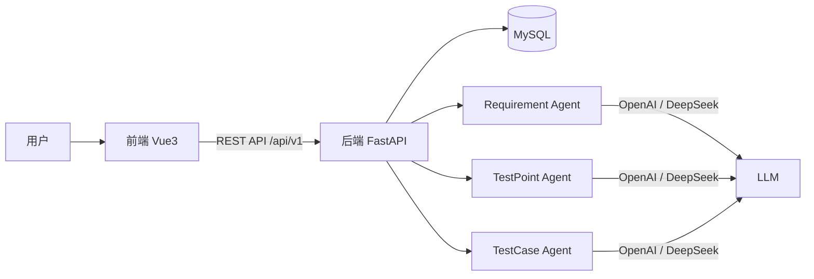

# AITestAgent —— 基于 AI Agent 的软件测试辅助平台

> 毕业设计项目：通过 AI Agent 自动完成「需求解析 → 测试点生成 → 测试用例生成」的软件测试辅助流程。

## 1. 项目简介

本平台面向软件测试人员，实现以下核心流程：

上传需求文档（Word / PDF） → AI 解析需求 → 提取功能模块 → AI 生成测试点 → AI 生成测试用例 → 保存数据库 → 导出 Excel

系统采用三个相互独立的 AI Agent 协作：

| Agent | 职责 |
| --- | --- |
| Requirement Agent | 解析需求文档，提取功能模块与需求摘要 |
| TestPoint Agent | 基于解析结果生成测试点 |
| TestCase Agent | 基于测试点生成完整测试用例 |

## 2. 技术栈

| 层级 | 技术 |
| --- | --- |
| 前端 | Vue 3、TypeScript、Vite、Element Plus、Pinia、Vue Router、Axios |
| 后端 | Python、FastAPI、SQLAlchemy、Pydantic |
| 数据库 | MySQL 8.0 |
| AI | LangChain、OpenAI API、DeepSeek API |
| 文档解析 | python-docx、pdfplumber |
| Excel 导出 | openpyxl |
| 部署 | Docker、Docker Compose、Nginx |

## 3. 系统架构



前后端分离部署：前端由 Nginx 托管静态资源并反向代理 `/api` 到后端；后端通过 SQLAlchemy 访问 MySQL。

## 4. 功能列表

| 页面 | 说明 | 开发阶段 |
| --- | --- | --- |
| 登录 | 用户名密码登录，JWT 认证（含注册） | ✅ 已完成 |
| Dashboard | 项目、测试点、测试用例统计概览 | 后续阶段 |
| 项目管理 | 项目 CRUD（分页、搜索） | ✅ 已完成 |
| 新建项目 | 创建项目表单 | ✅ 已完成 |
| 上传需求文档 | 上传 Word / PDF / TXT / Markdown，提取文本 | ✅ 已完成 |
| AI 解析结果 | Requirement Agent 解析：模块、功能点、角色、流程、风险 | ✅ 已完成 |
| 测试点管理 | TestPoint Agent 生成五类测试点 + 人工编辑 | ✅ 已完成 |
| 测试用例管理 | AI 生成测试用例 + 人工编辑 | 第七阶段 |
| AI 聊天助手 | 与 AI Agent 对话 | 第九阶段 |
| 系统设置 | AI 接口配置（OpenAI / DeepSeek）等 | 第十阶段 |

## 5. 项目目录结构

```text
AITestAgent/
├── backend/                    # 后端（FastAPI）
│   ├── app/
│   │   ├── main.py             # 应用入口
│   │   ├── core/               # 配置（config.py）
│   │   ├── db/                 # 数据库引擎与会话
│   │   ├── models/             # ORM 模型（7 张表）
│   │   ├── schemas/            # Pydantic 数据模型（后续阶段）
│   │   ├── services/           # 业务逻辑层（后续阶段）
│   │   ├── agents/             # AI Agent 层（后续阶段）
│   │   └── api/v1/             # API v1 路由
│   ├── requirements.txt
│   ├── .env.example
│   └── Dockerfile
├── frontend/                   # 前端（Vue3 + Vite）
│   ├── src/
│   │   ├── router/             # 路由配置
│   │   ├── layout/             # 主布局（侧边栏 + 顶栏）
│   │   ├── views/              # 页面（10 个）
│   │   └── utils/              # Axios 封装
│   ├── Dockerfile
│   ├── nginx.conf
│   └── .env.development
├── docs/
│   └── sql/init.sql            # 数据库初始化脚本
├── docker-compose.yml          # 一键编排：MySQL + 后端 + 前端
├── .env.example
└── README.md
```

## 6. 快速开始（Docker 一键部署）

前置条件：已安装 Docker Desktop。

```bash
# 1.（可选）复制环境变量并修改默认密码
cp .env.example .env

# 2. 构建并启动全部服务
docker compose up -d --build
```

启动完成后访问：

| 服务 | 地址 |
| --- | --- |
| 前端 | http://localhost |
| 后端 API 文档（Swagger） | http://localhost:8000/docs |
| 后端 ReDoc | http://localhost:8000/redoc |

默认管理员账号：`admin` / `admin123`（登录功能上线后请立即修改）。

> 注意：MySQL 数据保存在 Docker 卷 `mysql_data` 中，数据库初始化脚本仅在首次启动时自动执行。

## 7. 本地开发

### 7.1 后端

```bash
cd backend

# 创建并激活虚拟环境（Python 3.12）
python -m venv .venv
.venv\Scripts\activate        # Windows
# source .venv/bin/activate   # Linux / macOS

# 安装依赖
pip install -r requirements.txt

# 准备数据库（任选其一）
# 方式一：仅启动 MySQL 容器
docker compose up -d mysql
# 方式二：本机已有 MySQL，手动执行初始化脚本
mysql -u root -p < docs/sql/init.sql

# 配置环境变量
copy .env.example .env

# 启动开发服务器（热重载）
uvicorn app.main:app --reload --port 8000
```

访问 http://localhost:8000/docs 查看 Swagger 文档。

### 7.2 前端

```bash
cd frontend
pnpm install
pnpm dev
```

访问 http://localhost:5173，开发服务器已将 `/api` 请求代理到 http://localhost:8000。

### 7.3 前端构建

```bash
cd frontend
pnpm build   # 产物输出到 dist/
```

### 7.4 一键启停（可选）

项目根目录提供两个脚本，适合本地开发时快速开关前后端服务：

```bash
.\start-dev.ps1   # 一键启动后端(8000) + 前端(5173)
.\stop-dev.ps1    # 一键停止
```

## 8. 数据库设计

共 8 张表，完整 DDL 见 [docs/sql/init.sql](docs/sql/init.sql)：

| 表名 | 说明 | 关键字段 |
| --- | --- | --- |
| users | 系统用户 | username（唯一）、password_hash、role、status |
| projects | 测试项目 | name、description、status、owner_id |
| requirements | 需求文档 | project_id、file_name、file_path、parse_status、parse_result |
| modules | 功能模块 | project_id、requirement_id、name、sort_order |
| test_points | 测试点 | project_id、requirement_id、module_id、name、category |
| test_cases | 测试用例 | project_id、module_id、case_no、test_point、priority、steps、expected_result |
| chat_history | AI 聊天记录 | user_id、project_id、role、content |
| operation_logs | 操作日志 | user_id、action、module、detail、ip |

约定：所有表使用 `utf8mb4` 字符集、InnoDB 引擎，统一包含 `created_at` / `updated_at` 时间戳字段，主键为自增 `BIGINT`。

## 9. API 文档

- Swagger UI：`/docs`
- ReDoc：`/redoc`
- OpenAPI JSON：`/api/openapi.json`

接口规范：

- RESTful 风格，统一前缀 `/api/v1`
- 遵循 OpenAPI 规范，由 FastAPI 自动生成
- 后续阶段将引入统一响应结构与操作日志记录
- 认证方式：登录成功后返回 JWT 令牌，后续请求在请求头携带 `Authorization: Bearer <token>`；
  Swagger 页面点击右上角「Authorize」按钮输入令牌即可调试受保护接口

当前可用接口：

| 方法 | 路径 | 说明 | 权限 |
| --- | --- | --- | --- |
| GET | / | 服务信息 | 公开 |
| GET | /api/v1/health | 健康检查 | 公开 |
| POST | /api/v1/auth/register | 用户注册 | 公开 |
| POST | /api/v1/auth/login | 用户登录（OAuth2 表单） | 公开 |
| GET | /api/v1/users/me | 当前用户信息 | 登录用户 |
| GET | /api/v1/users | 用户列表 | 管理员 |
| PATCH | /api/v1/users/{user_id}/status | 启用/禁用用户 | 管理员 |
| POST | /api/v1/projects | 创建项目 | 登录用户 |
| GET | /api/v1/projects | 项目列表（分页 + 搜索） | 登录用户 |
| GET | /api/v1/projects/{project_id} | 项目详情 | 创建人/管理员 |
| PATCH | /api/v1/projects/{project_id} | 更新项目 | 创建人/管理员 |
| DELETE | /api/v1/projects/{project_id} | 删除项目 | 创建人/管理员 |
| POST | /api/v1/projects/{project_id}/requirements/upload | 上传需求文档（docx/pdf/txt/md） | 创建人/管理员 |
| GET | /api/v1/projects/{project_id}/requirements | 需求文档列表（分页） | 创建人/管理员 |
| GET | /api/v1/projects/{project_id}/requirements/{id} | 需求文档详情（含文本内容） | 创建人/管理员 |
| DELETE | /api/v1/projects/{project_id}/requirements/{id} | 删除需求文档 | 创建人/管理员 |
| POST | /api/v1/projects/{project_id}/requirements/{id}/parse | 调用 Requirement Agent 解析需求 | 创建人/管理员 |
| GET | /api/v1/projects/{project_id}/requirements/{id}/parse-result | 获取 AI 解析结果 | 创建人/管理员 |
| POST | /api/v1/projects/{project_id}/requirements/{id}/test-points/generate | 调用 TestPoint Agent 生成测试点 | 创建人/管理员 |
| GET | /api/v1/projects/{project_id}/test-points | 测试点列表（筛选 + 分页） | 创建人/管理员 |
| PATCH | /api/v1/projects/{project_id}/test-points/{id} | 编辑测试点（人工） | 创建人/管理员 |
| DELETE | /api/v1/projects/{project_id}/test-points/{id} | 删除测试点 | 创建人/管理员 |

## 10. Excel 导出格式

测试用例导出 Excel 的固定列格式：

| 编号 | 优先级 | 模块 | 功能 | 测试点 | 前置条件 | 步骤 | 预期结果 | 备注 |
| --- | --- | --- | --- | --- | --- | --- | --- | --- |

该格式与 `test_cases` 表字段一一对应。

## 10.1 AI Agent 设计

系统采用三个相互独立的 AI Agent，由统一的 LLM 供应商层驱动（LangChain + OpenAI 兼容协议），可在 OpenAI 与 DeepSeek 之间切换：

| 配置项 | 说明 |
| --- | --- |
| `AI_PROVIDER` | `openai` / `deepseek` / `demo`（演示模式无需 API Key） |
| `OPENAI_API_KEY` / `OPENAI_BASE_URL` / `OPENAI_MODEL` | OpenAI 接入配置 |
| `DEEPSEEK_API_KEY` / `DEEPSEEK_BASE_URL` / `DEEPSEEK_MODEL` | DeepSeek 接入配置 |

**Requirement Agent（已完成）**：读取需求文档文本，输出结构化 JSON（需求概述、功能模块、功能点、用户角色、业务流程、风险点），解析结果保存至 `requirements.parse_result`，并同步功能模块到 `modules` 表。切换方式：修改 `backend/.env` 中的 `AI_PROVIDER` 并配置对应密钥。

**TestPoint Agent（已完成）**：根据功能模块与功能点，为每个功能点生成五类测试点（正常流程、异常流程、边界值、安全、兼容性），保存至 `test_points` 表，支持重新生成与人工编辑。

TestCase Agent 将在后续阶段实现。

## 11. 开发路线图

- [x] 第一阶段：搭建项目（目录、前后端初始化、Docker、数据库、README）
- [x] 第二阶段：登录（JWT 认证、用户管理）
- [x] 第三阶段：项目管理
- [x] 第四阶段：上传需求文档
- [x] 第五阶段：AI 解析需求
- [x] 第六阶段：测试点生成
- [ ] 第七阶段：测试用例生成
- [ ] 第八阶段：Excel 导出
- [ ] 第九阶段：AI 聊天
- [ ] 第十阶段：系统优化
- [ ] 第十一阶段：Docker 部署
- [ ] 第十二阶段：答辩准备

## 12. 环境要求

- Node.js 20+ / pnpm
- Python 3.12
- MySQL 8.0（本地开发或 Docker）
- Docker Desktop（可选，用于一键部署）
